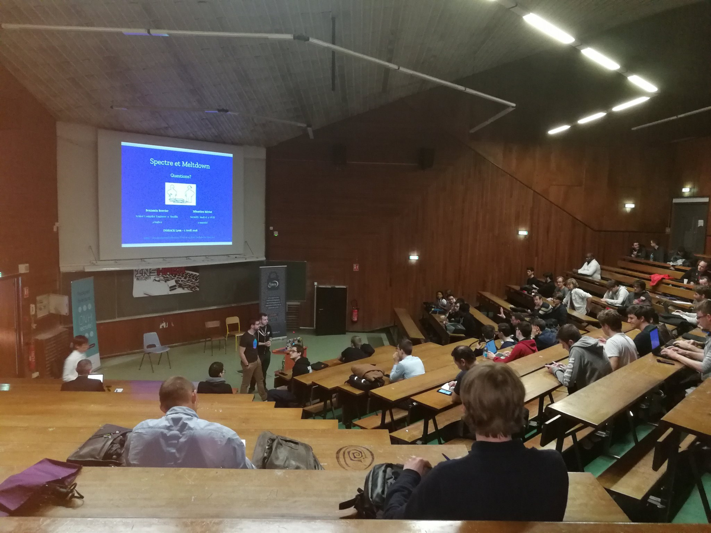
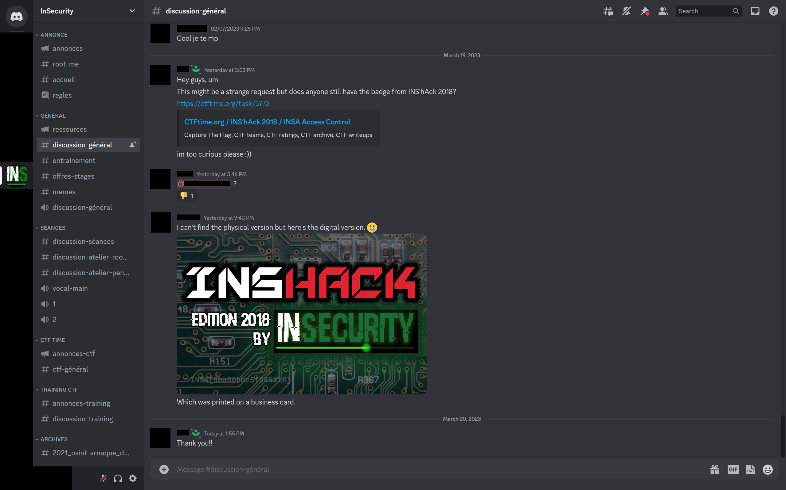
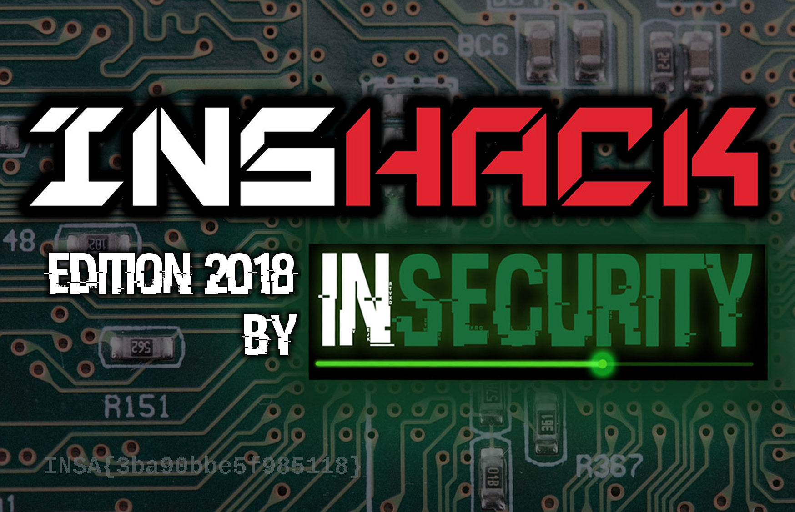

# INSHack 2018 - INSA Access Control
```Writeup by shezik```

## 题目初探
题目简介如下：  
```markdown
This is an on-site challenge. Join us!

What allowed you to stay here?
```

啥现场挑战？以及什么允许我呆在这儿？？（蒙蔽脸）  
然后翻了一下官方解答：  
```markdown
Look at your badge!

(0pts challenge for onsite teams)
```

草你让我上哪找五年前的 badge  
网上倒是能搜到当年的 presentation 照片，不过都没有挂在脖子上或者贴在胸口的小牌子  


难道就这样结束了吗？BuuCTF 上这题的分数可高着呢（

## 解题过程
[InSecurity 的官网](https://insecurity-insa.fr/)上挂着一张 Discord 二维码。扫一下添加群聊，于是就有了下面这段对话。（长草的是我）  


我们放大看看：  


就这样得到了 Flag。这可是一手资料喔 ;\)

## 总结
~互联网是好东西~
