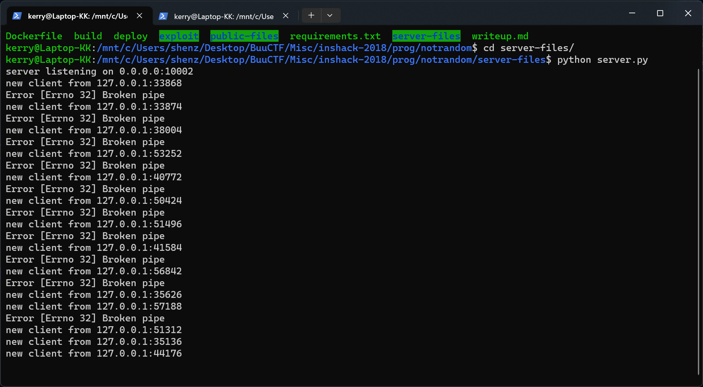

# INSHack 2018 - Not So Random
***Writeup by shezik***

## 题目初探
题目简介如下：  
```markdown
# Definitely random

Try to show us you have the luck needed to get your degree!

<code>nc notrandom.ctf.insecurity-insa.fr 10002</code>
```

还附带了服务器端代码：  
```python
#!/usr/bin/env python3

import os
import random
import socket
import secrets
import hashlib
from pathlib import Path
from argparse import ArgumentParser
from threading import Thread
from ruamel.yaml import safe_load


def get_commit(inst):
    jackpot = secrets.randbits(10)
    blind = inst.getrandbits(32)
    commit = hashlib.md5(str(jackpot+blind).encode()).hexdigest()
    return [commit,jackpot,blind]

class ClientThread(Thread):

    def __init__(self, ip, port, conn, flag):
        Thread.__init__(self)
        self.ip = ip
        self.port = port
        self.conn = conn
        self.flag = flag
        self.conn.send("Hello and welcome to \"Will you get your degree\" challenge !  \n".encode())
        self.inst = random.Random()
        self.init_credit = 1000

    def run(self):
        while (self.init_credit>0):
            try:
                commit_result = get_commit(self.inst)
                self.conn.send(("To be sure we are fair, here is the commitment of our future jackpot %s\n"%(commit_result[0])).encode())
                self.conn.send("Pick your magic number between 0 and 2**10 : \n".encode())
                player_input = self.conn.recv(2048)
                try:
                    int_input = int(player_input)
                    if int_input == commit_result[1]:
                        self.init_credit+=100
                        self.conn.send("Good guess !\n".encode())
                    else:
                        self.init_credit-=500
                except ValueError:
                    self.conn.send('Please enter an integer\n'.encode())
                if(self.init_credit>10000):
                    self.conn.send((self.flag+"\n").encode())
                    break
                self.conn.send(("Commitment values : {0:04d} + {1:10d}\n".format(commit_result[1],commit_result[2])).encode())
                self.conn.send(("You have %d credits remaining\n"%(self.init_credit)).encode())
            except socket.error as e:
                print("Error",e)
                break
        self.conn.close()

if __name__ == '__main__':
    p = ArgumentParser()
    p.add_argument('-c', '--config', type=Path, default=Path('.mkctf.yml'),
                   help="Configuration file.")
    args = p.parse_args()

    with open(args.config) as f:
        conf = safe_load(f)

    tcpHost = '0.0.0.0'
    tcpPort = conf['parameters']['port']
    flag = conf['flag']

    tcpServer = socket.socket(socket.AF_INET, socket.SOCK_STREAM)
    tcpServer.setsockopt(socket.SOL_SOCKET, socket.SO_REUSEADDR, 1)
    tcpServer.bind((tcpHost, tcpPort))
    print("server listening on {}:{}".format(tcpHost, tcpPort))
    threads = []

    try:
        while True:
            tcpServer.listen()
            (conn, (ip, port)) = tcpServer.accept()
            print("new client from {}:{}".format(ip, port))
            newthread = ClientThread(ip, port, conn, flag)
            newthread.start()
            threads.append(newthread)

        for t in threads:
            t.join()
    except KeyboardInterrupt:
        os._exit(0)
```

运行输出如下：  
  
请无视 *server listening on 0.0.0.0:10002* 以下的内容，特别是 *Broken pipe*，那是尝试使用浏览器访问的结果（  
正确的连接方式是使用 pwntools：`pwn.remote('0.0.0.0', 10002)`。

## 代码审计
游戏玩法：

服务端生成一个 10 位的随机数（0~1023，代码中称为 *jackpot*），并和 32 位随机盐值相加（*blind*），打印 MD5 Hash 结果（*commitment*），等待玩家输入。玩家需要猜中这个 10 位的随机数，猜中加 100 分，猜错扣 500 分。玩家的初始积分是 1,000，当积分大于 10,000 时服务器打印 Flag。

有趣的是，不管玩家输入的是什么，服务器都会**打印上一次的随机数和盐值**。而且，配合题目名字 *Definitely Random*，从服务器代码中我们不难发现，10 位随机数的生成使用的是 secrets 库，而盐值的生成使用的是 **random** 库。

这是 random 库的官方介绍：  
  
其指出，生成随机数的实现是 *Mersenne Twister* 算法。

再看看这个：  
  
这是 *Mersenne Twister* 预测器！

直接进入我们最爱的
## 撰写脚本
环节。我已经加班加点写好辣！

```python
import pwn
from mt19937predictor import MT19937Predictor
import hashlib

class Solution:
    def __init__(self, ip, port):
        self.ip = ip
        self.port = port
        self.conn = None
        self.predictor = MT19937Predictor()
        self.state = {'blind': '', 'credits': '', 'commitment': ''}

    def connect(self):
        self.conn = pwn.remote(self.ip, self.port)

    def analyzeBlind(self, n=624):
        i = 0
        while i < n:
            print('{} of {}'.format(i + 1, n))
            self.conn.send('a')  # Any non-integer value
            self.recvAndAnalyze()
            blind = self.state['blind']
            if blind != '':
                self.predictor.setrandbits(int(blind), 32)
                i += 1

    def run(self):
        self.connect()
        print('Analyzing server-side Mersenne Twister RNG...')
        self.analyzeBlind()
        print('Bruteforcing jackpot value...')
        while True:
            self.bruteforceJackpot()

    def bruteforceJackpot(self):
        commitment = self.state['commitment']
        predictedBlind = self.predictor.getrandbits(32)
        for i in range(2**10):
            if commitment == hashlib.md5(str(i + predictedBlind).encode()).hexdigest():
                self.conn.send(str(i))
                self.recvAndAnalyze()
                print('Found jackpot: {}\tCurrent credits: {}'.format(i, self.state['credits']))
                break
        else:
            raise Exception('No solution found! Bad prediction?')

    def recvAndAnalyze(self):
        while True:
            line = self.conn.recvline(timeout=0.1).decode('utf-8')
            if line == '':
                break
            elif line.find('Commitment values : ') != -1 and line.find(' + ') != -1:
                self.state['blind'] = line[line.find(' + ') + len(' + ') : -1]
            elif line.find(' credits remaining') != -1:
                self.state['credits'] = line[len('You have ') : line.find(' credits remaining')]
            elif line.find('INSA{') != -1:
                raise Exception('Flag found!!! {}'.format(line[ : -1]))  # Print flag and terminate
            elif line.find('To be sure we are fair, here is the commitment of our future jackpot ') != -1:
                self.state['commitment'] = line[len('To be sure we are fair, here is the commitment of our future jackpot ') : -1]

if __name__ == '__main__':
    solution = Solution('127.0.0.1', 10002)
    solution.run()
```

这段脚本首先向服务器发送 'a' 来在不扣分的情况下获得盐值。重复这个步骤 624 次来确定服务器端随机数生成器的状态，再遍历 0~1024 与预测的随机数相加，计算 MD5 Hash，与服务器打印的 *commitment* 相比对。如果发现 match，就提交这个数字，赚取分数。

运行结果如下：  
  
大概花了一分钟的时间就跑出了 Flag。

## 总结
学到了：
- pwntools 的基础使用方法
- 不要用 random 库生成秘密的东西

~好像我的 Python 越来越熟练了~
