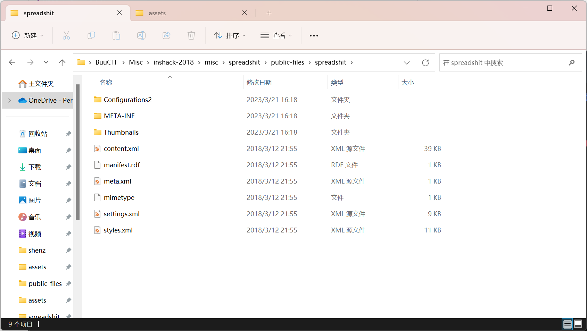
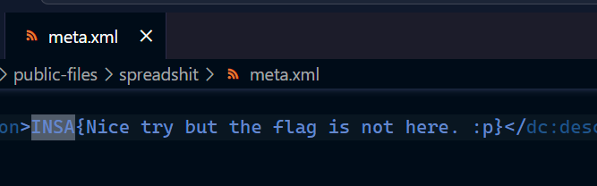
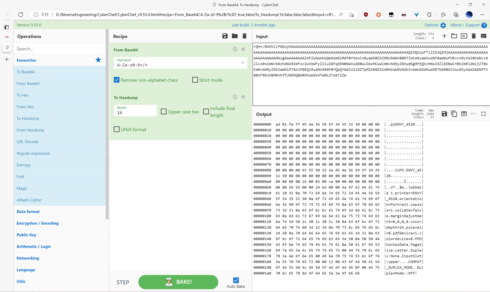
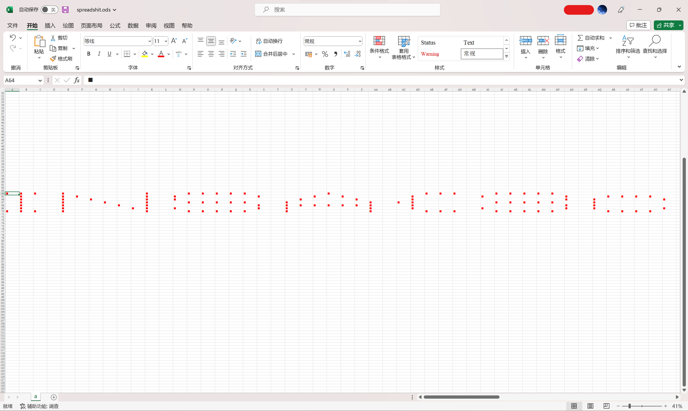
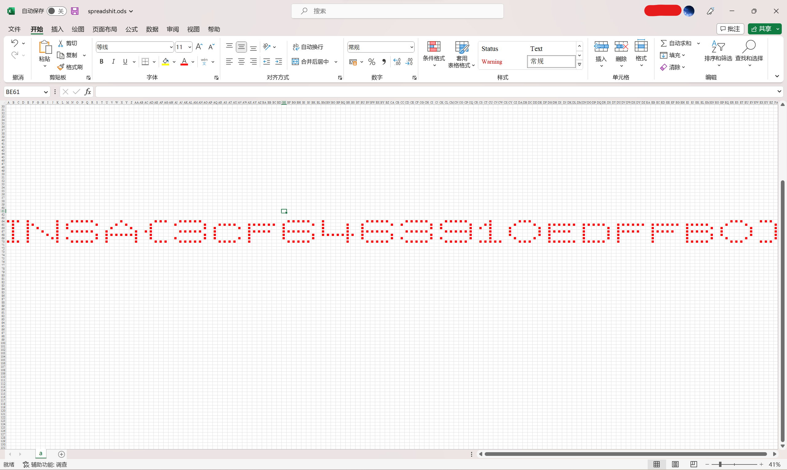

# INSHack 2018 - Spreadshit
***Writeup by shezik***

## 题目初探
题目简介如下：  
```markdown
# MISC | Spreadshit

This spreadsheet doesn't contain anything interesting... Or does it ?
```

附带一个 `spreadshit.ods` 文件。打开一看是空的，解压看看。  


在这些文件中搜索 *INSA*，只有 `meta.xml` 中有搜索结果，还是空欢喜。  
  


`settings.xml` 中还有一个 `PrinterSetup` 标签，用 Base64 解码也没什么有用的信息。  


## 解题过程
在表格文件中搜不到 *INSA*，也没有 *flag* 的匹配结果。搜一下通配符倒是出现一堆结果，都是空格。  
想破头皮也想不出什么东西来，干脆用字符替换一下空格。  



拉窄一点列宽，得到 Flag: INSA{3cf6463910edffb0}。 大小写都试了一下，小写是对的。  


## 总结
- Try thinking ouside the box 
