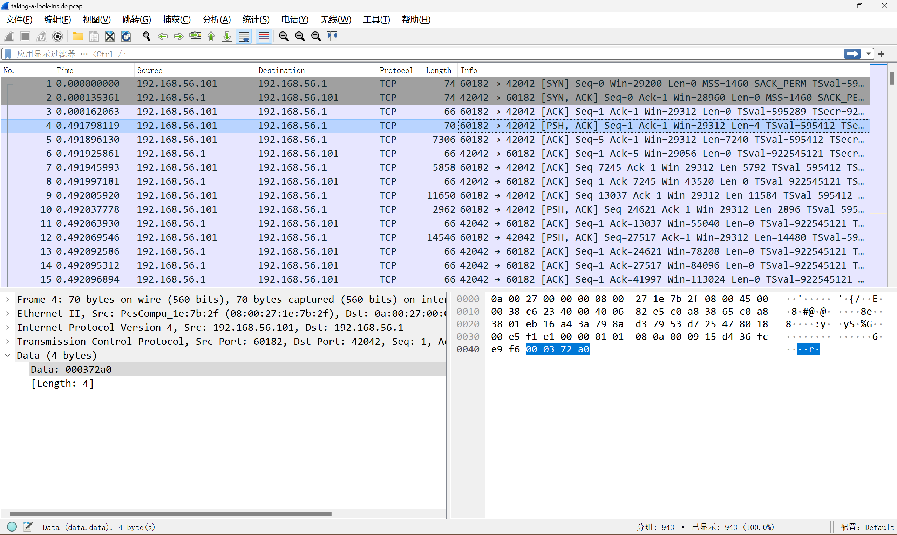
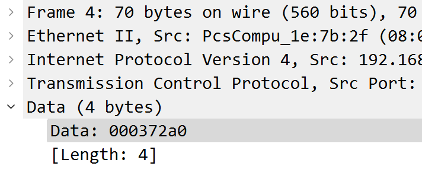
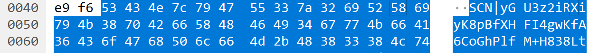
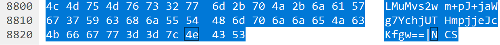
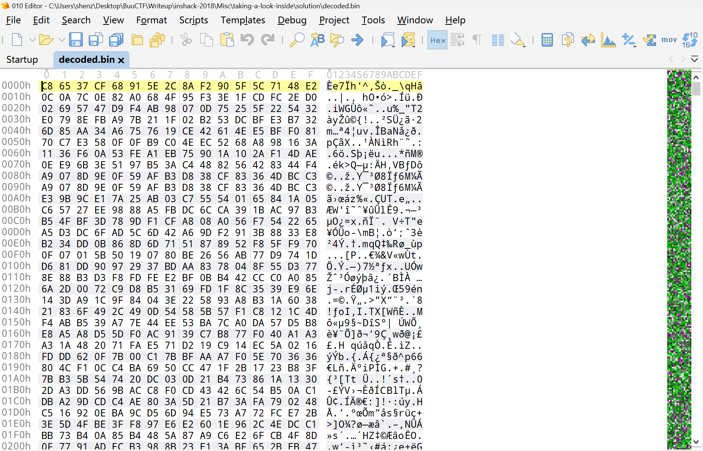
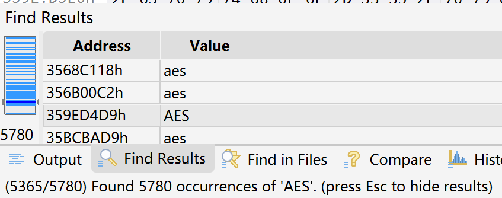
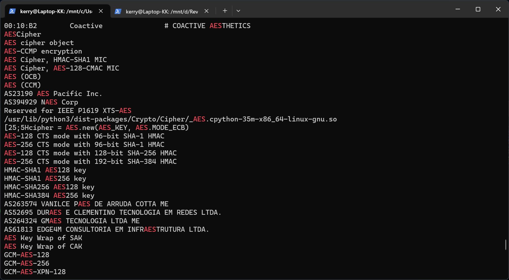
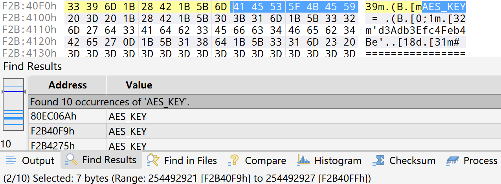
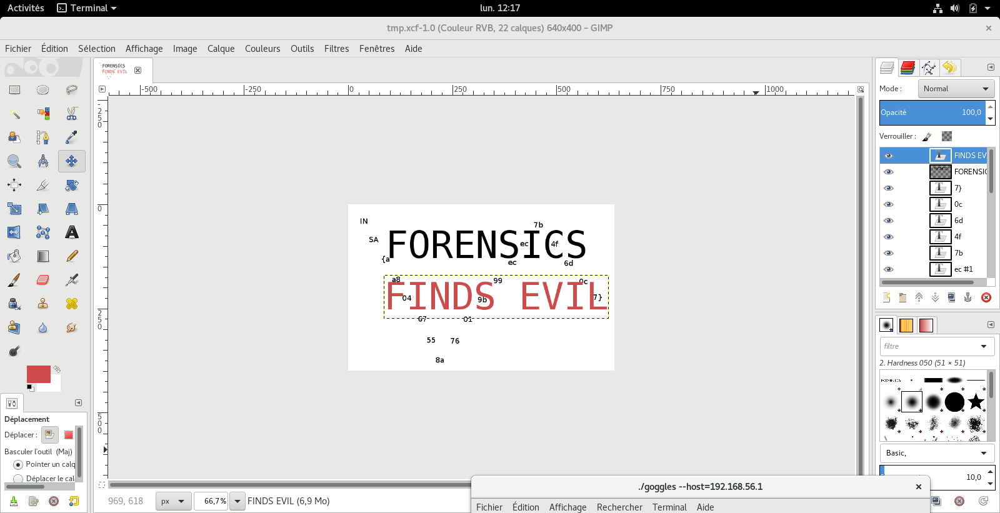

# INSHack 2018 - Taking a look inside
***Writeup by shezik***

## 题目初探
题目介绍如下：  
```markdown
# Forensics | Taking a look inside

I acquired some information about my PC because I think someone messed up
with it...

You can find everything [here](https://mega.nz/#!1ddgGKTB!Qf-BuTtP7FwsDuHAwmH5TJ7ZAbDnMtr3pSPQHgI7WWM).

Please find out what's wrong about these captures.

Have fun!
```

Mega 网盘链接指向一个压缩包，解压后有一个 dmp 文件和一个 pcap 文件。后者可以用 Wireshark 打开，至于前者，多半是内存 dump 罢。

## 解题过程
使用 Wireshark 打开：  


大致翻了一下，其中长度可观的是 `192.168.56.101` 发送给 `192.168.56.1` 的数据包，反之都是长度为 66 的 ACK 包，没啥价值。
下文提到*数据包*时，默认指的是 **`192.168.56.101` 发送给 `192.168.56.1`** 的，**带有 Data** 的数据包。

第一个数据包内容是 `000372A0`，猜测可能是数据长度。称其为长度包吧。（？）  


下一个数据包的内容以 `SCN|` 开头，意义不明；接着是看起来像 Base64 编码的数据，有趣的是结尾没有等号。称其为 Base64 包吧。（？？）  


长度包每隔几个 Base64 包就会出现一个，暂时认为它们之间的 Base64 包是一个数据块。  
观察发现，每个数据块的第一个 Base64 包都以 `SCN|` 开头，最后一个 Base64 包都以 `|NCS` 结尾，而且只有这个包的结尾有等号。可以猜测，Base64 解码的范围是每个数据块。  


尝试加了个过滤器 `ip.src == 192.168.56.101`，但是没发现批量导出 Data 的功能，又得写脚本了。

```python
import base64
from scapy.all import rdpcap

pcapSessions = rdpcap('taking-a-look-inside.pcap').sessions()
packets = pcapSessions['TCP 192.168.56.101:60182 > 192.168.56.1:42042']

data = b''
for packet in packets:
    if packet.haslayer('Raw'):
        data += packet.getlayer('Raw').original

decodedData = b''
while len(data) > 0:
    blockSize = int.from_bytes(data[0 : 4], "big")  # 4 bytes
    blockData = data[4 : blockSize+4]  # blockSize includes 'SCN|' and '|NCS'
    data = data[blockSize+4 : ]

    decodedData = base64.b64decode(blockData[4 : -4])

with open('decoded.bin', 'wb') as file:
    file.write(decodedData)
    file.close()
```  
（ 这段参考了官方解法，主要是不会用 rdpcap（悲 ）

看一下提取出来的数据：  
  
看这均匀的小地图，多半是加密过的，烦诶。想起还有一个条件没用，就是那个内存 Dump。尝试搜索一下加密相关的关键词，万一有密钥呢。

  
天真了，搜 RSA 有 1070 个结果，搜 AES 有 5780 个结果，麻了

用 `strings` 命令加上 `grep` 看看。先执行 `strings taking-a-look-inside.dmp > strings.txt` 把字符串保存到本地文件，免得每次搜索都要等好久好久。  
再执行 `cat strings.txt | grep AES`，有个蛮有意思的结果，就是以 `cipher = ` 开头的那行。  


怀疑 `AES_KEY` 的值是密钥，使用 ECB 模式加解密。本来打算 dump 下来这个 Python 脚本的（？），但是不知道从哪下手，取证大师的试用激活还出了点问题。。

搜一下 `AES_KEY`。似乎是分两个字符串保存的，那就试试还在 Dump 文件中搜索，结果有点开心。  


知道是 AES ECB 模式加密，还掌握了密钥，修改一下脚本罢。  
```python
import base64
from scapy.all import rdpcap
from Crypto.Cipher import AES

pcapSessions = rdpcap('taking-a-look-inside.pcap').sessions()
packets = pcapSessions['TCP 192.168.56.101:60182 > 192.168.56.1:42042']

data = b''
for packet in packets:
    if packet.haslayer('Raw'):
        data += packet.getlayer('Raw').original

cipher = AES.new(b'd3Adb3Efc4Feb4Be', AES.MODE_ECB)

decryptedData = b''
while len(data) > 0:
    blockSize = int.from_bytes(data[0 : 4], "big")  # 4 bytes
    blockData = data[4 : blockSize+4]  # blockSize includes 'SCN|' and '|NCS'
    data = data[blockSize+4 : ]

    decryptedData = cipher.decrypt(base64.b64decode(blockData[4 : -4]))

with open('decrypted.bin', 'wb') as file:
    file.write(decryptedData)
    file.close()
```

用 16 进制编辑器打开 `decrypted.bin`，发现是 PNG 文件，内容如下：  
  
（ 突然冒出来的使命感（逃 ）

## 总结
学会了：
- rdpcap 的使用方法
- 分析 pcap 文件的方法
- 分析 RAM Dump 的方法（本来打算用 Volatility 的··· 用不明白）
