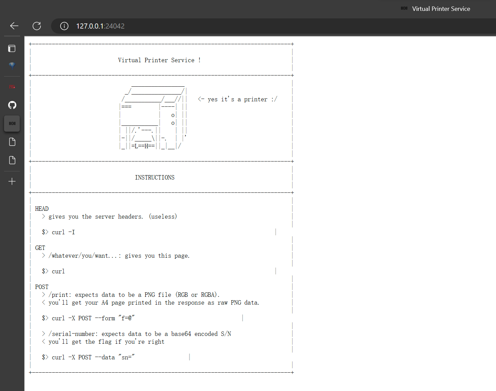
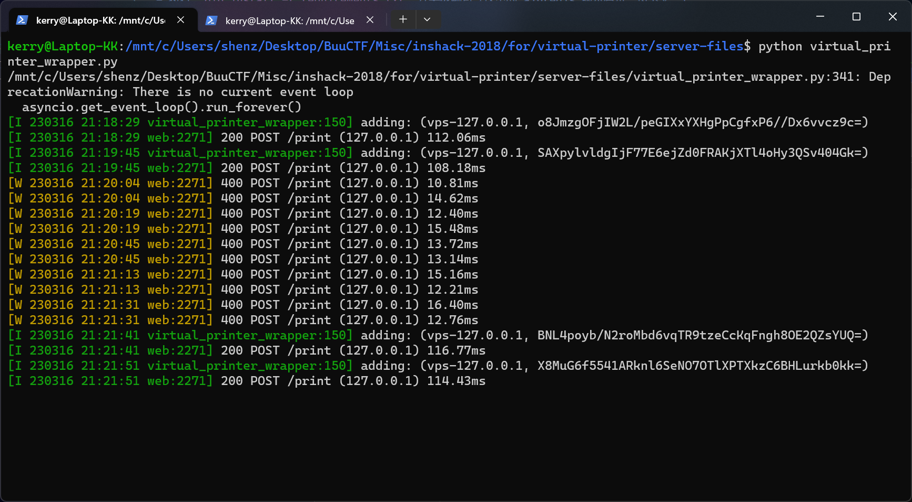
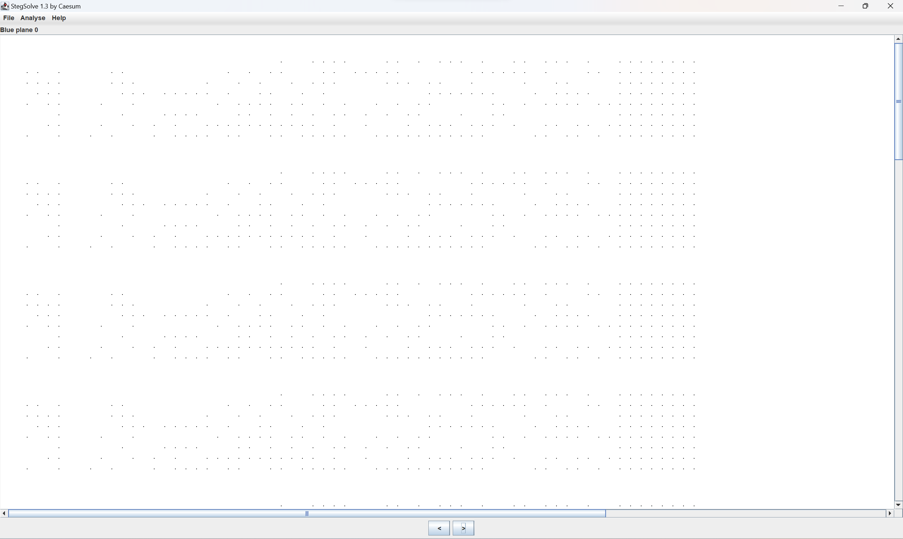
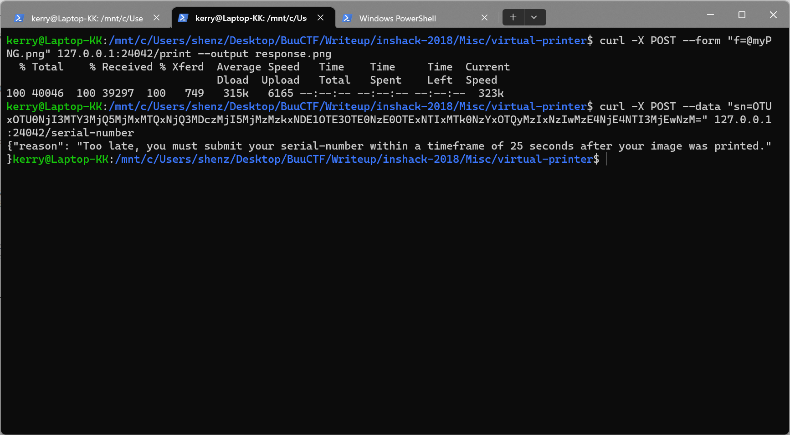
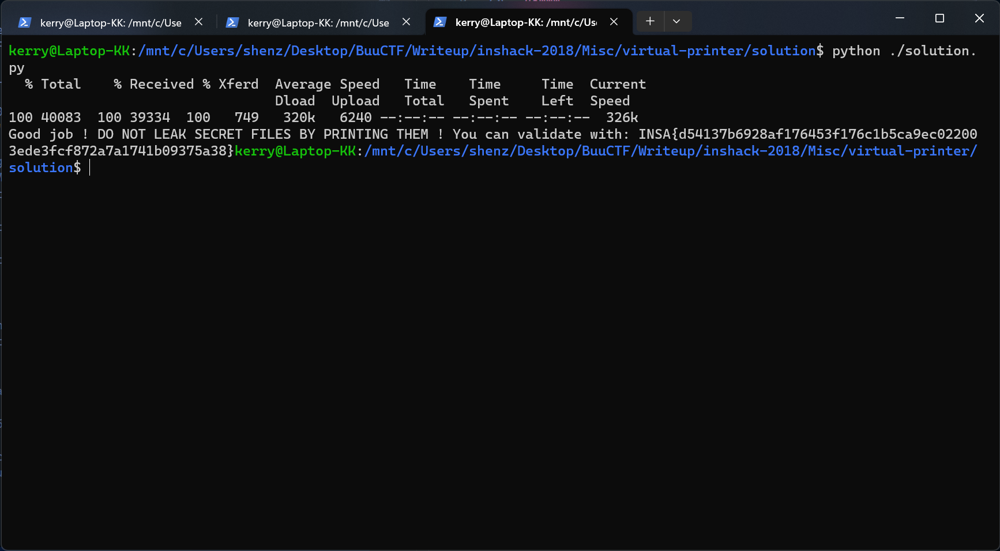

# INSHack 2018 - Virtual Printer
***Writeup by shezik***

## 部署环境（WSL 2 环境）
- 执行 `pip install -r requirements.txt` 安装依赖包（这里的 aioredis 版本有坑，见下文。）
- 执行 `sudo apt install redis-server` 安装 Redis 服务器
- 执行 `sudo service redis-server start` 启动 Redis 服务器
- 复制 `.mkctf.yml` 到 `server-files` 目录下
- 执行 `python virtual_printer_wrapper.py`  
  这一步出现了一点小问题，在 Python 3.11 环境下运行 `virtual_printer_wrapper.py` 时报错 *TypeError: duplicate base class TimeoutError*。一种解决方案是换用 Python 3.10，然后执行 `pip uninstall aioredis` `pip install aioredis==1.3.1` 来降级 aioredis。

## 题目初探
浏览器访问 `localhost:24042`，界面如下：  


提示解题流程为 POST 一张 RGB 或 RGBA 色彩空间的 PNG 文件到 `/print` 路径下，服务器会返回一张 A4 大小的 PNG 数据；再通过某种方式得到打印机的 S/N 码，使用 Base64 编码后 POST 到 `/serial-number` 路径下，得到 flag。

那就先用 GIMP 做一张小尺寸的 PNG 文件上传上去看看。  
POST 成功，控制台输出如图所示：  
  


看一下返回的图片：  


乍一看什么也没有，不过联想到激光打印机在纸上留下的黄色点状水印，决定使用 StegSolve 检查一下，真的发现了类似的信息。  


完整文件：  


## 水印分析
导入 GIMP，得知水印从 (50, 50) 开始，xy 间隔 19 个白色像素，横向有 64 个 bit，纵向有 8 个 bit（但是不知道哪一侧是低位）。可以猜测纵向排列的 8 个 bit 组成一个字节，共 64 字节。

写一个 Python 脚本来解码吧。  
```python
from PIL import Image

imageFile = Image.open('response.png')
imageMap = imageFile.load()

bitStringList = list()

for x in range(50, 1310 + 1, 20):
    bitString = ''
    for y in range(50, 190 + 1, 20):
        if imageMap[x, y] != (255, 255, 255):
            bitString += '1'
        else:
            bitString += '0'

    bitStringList.append(bitString)

information = ''
for i in bitStringList:
    information += chr(int(i, 2))

print(information)
```

运行输出如下：  
```
ip:
at:3
S/N:_Ã.ùç@FIåé';³sÓ^LÂè˺¹I
ÿÿÿÿÿÿÿÿ
```

smjb  


看来只有开头的几个字节是 ASCII 编码，末尾还有 8 个多余的 FF。修改一下脚本吧。不过，至少我们知道下侧是低位了。  
```python
from PIL import Image

imageFile = Image.open('response.png')
imageMap = imageFile.load()

bitStringList = list()

for x in range(50, 1150 + 1, 20):  # Drop trailing eight FFs
    bitString = ''

    for y in range(50, 190 + 1, 20):
        if imageMap[x, y] != (255, 255, 255):
            bitString += '1'
        else:
            bitString += '0'

    bitStringList.append(bitString)

information = ''
isRawData = False

for i in bitStringList:
    byte = chr(int(i, 2))

    # Raw data starts from ‘:' to '\n'.
    if byte == ':':
        isRawData = True
        # But this one is not raw!
        information += byte
        continue
    elif byte == '\n':
        isRawData = False

    if isRawData:    
        information += str(ord(byte))
    else:
        information += byte

print(information)
```

运行输出如下：  
```
ip:127001
at:1632023212151
S/N:95195462716724923114164707322923339141591791471491152119476194232172031861852721073
```

## 撰写脚本
兴高采烈地转码 Base64 提交，结果还限制时间！？  
  


这里犯了一个错误。事实上，需要转换为 Base64 的数据是**二进制数据**而不是上文得到的**字符串**。

好好好，那就自动化一下吧。Python 脚本如下：  
```python
from PIL import Image
import os
import subprocess
import base64

imageFilename = 'response.png'

if os.path.exists(imageFilename):
    os.remove(imageFilename)

subproc = subprocess.Popen('curl -X POST --form "f=@myPNG.png" 127.0.0.1:24042/print --output response.png', shell=True)
subproc.wait()


imageFile = Image.open(imageFilename)
imageMap = imageFile.load()

bitStringList = list()

for x in range(50, 1150 + 1, 20):  # Drop trailing eight FFs
    bitString = ''

    for y in range(50, 190 + 1, 20):
        if imageMap[x, y] != (255, 255, 255):
            bitString += '1'
        else:
            bitString += '0'

    bitStringList.append(bitString)


snIndex = 23
snList = bitStringList[snIndex : -1]  # Drop '\n'
snByteArray = bytearray()

for i in snList:
    snByteArray.append(int(i, 2))

encodedSN = base64.b64encode(bytearray(snByteArray)).decode('utf-8')

subproc = subprocess.Popen('curl -X POST --data "sn={}" 127.0.0.1:24042/serial-number'.format(encodedSN), shell=True)
subproc.wait()
```

运行输出如下，得到 Flag：  


## 总结
- `base64.b64encode()` 返回的似乎是 ByteArray，需要通过 decode 操作才能转换为普通字符串。
- `subprocess.Popen()` 比 `os.system()` 好用得多。
- StegSolve 是神器。
- 渐渐熟悉了 `curl` 的使用。
- ~不要通过打印的方式泄露机密文件~
