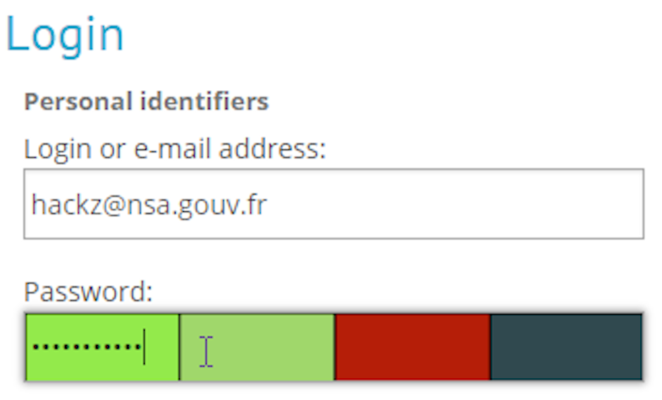

# INSHack 2018 - Visual Hashing Easy
***Writeup by shezik***

## 题目初探
题目简介如下：  
```markdown
# Misc | Visual hashing - easy

We managed to capture the video feed on one of the top Institute of NSA officials.

Our intel forces told us the target is using [this Chrome extension](https://chrome.google.com/webstore/detail/visual-hashing/lkoelcpcjjehbjcchcbddggjmphfaiie).

Please help us retrieve the password.
```

~多少沾点中二。~  
初步决定先安装上文所述 Chrome 插件，再从附件中的 `nsa.avi` 提取帧，最后人肉穷举。希望 Flag 不要太长太复杂。

## 解题过程
先写个简单的示例密码框。  
```html
<!DOCTYPE html>
<html>
    <head>
        <title>Example password box</title>
    </head>
    <body>
        <form>
            <input type="password" placeholder="Password" />
        </form>
    </body>
</html>
```

别忘了在 Chrome 扩展设置中启用 `Visual Hashing` 插件访问本地文件的权限。

  
`I`: 考虑`INSA{`  
  
`N`  
  
`S`  
  
`A`  
  
`{`  
  
`w`: 穷举，考虑 `wow`  
  
`0`: 然而并不是 `o`, 是 `0`  
  
`w`  
  
`_`: 不是空格就是下划线  
  
`v`: 考虑 `visual`  
  
`1`: 猜到了。。  
  
`s`  
  
`u`  
  
`4`: 算是 `A` 的特殊写法  
  
`l`  
  
`_`  
  
`h`: 学会了，考虑 `h4sh1ng` (`hashing`)  
  
`4`  
  
`s`  
  
`h`  
  
`1`  
  
`n`  
  
`g`  
  
`z`: 穷举。。  
  
`}`

得到 Flag: `INSA{w0w_v1su4l_h4sh1ngz}`

## 总结
挺累的。。主要是不熟悉 *leetspeak*。