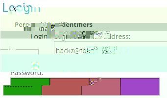
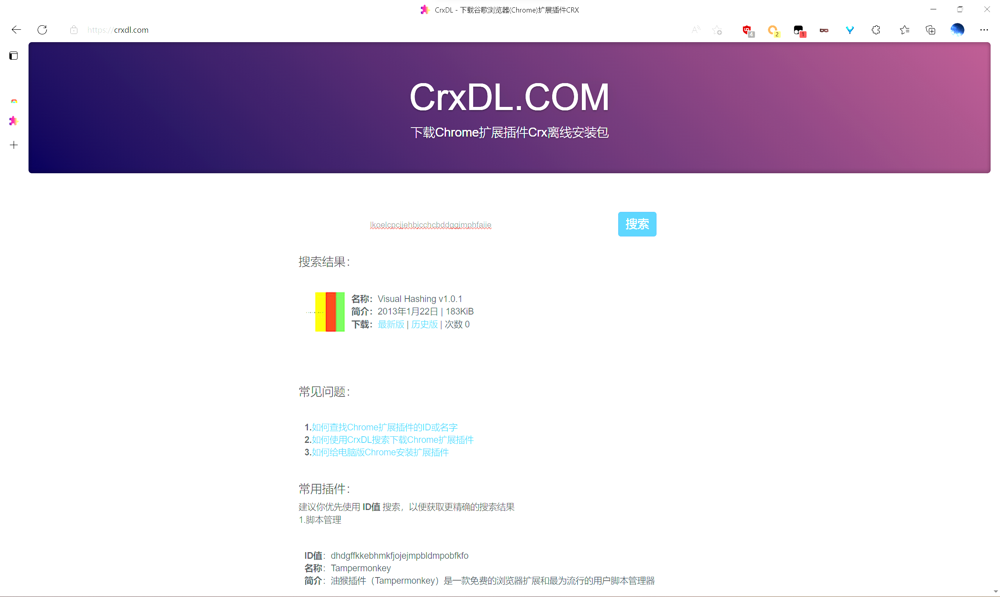
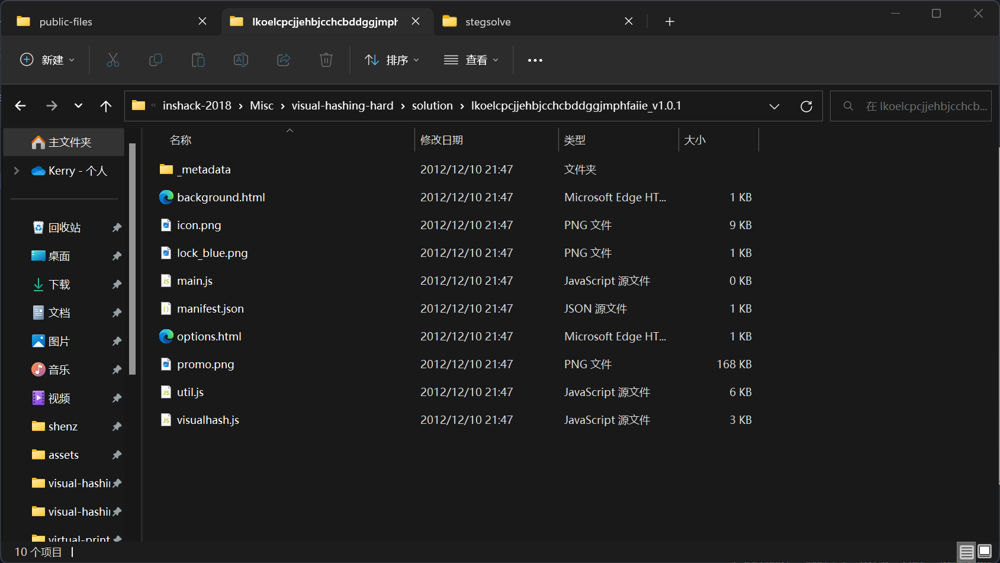
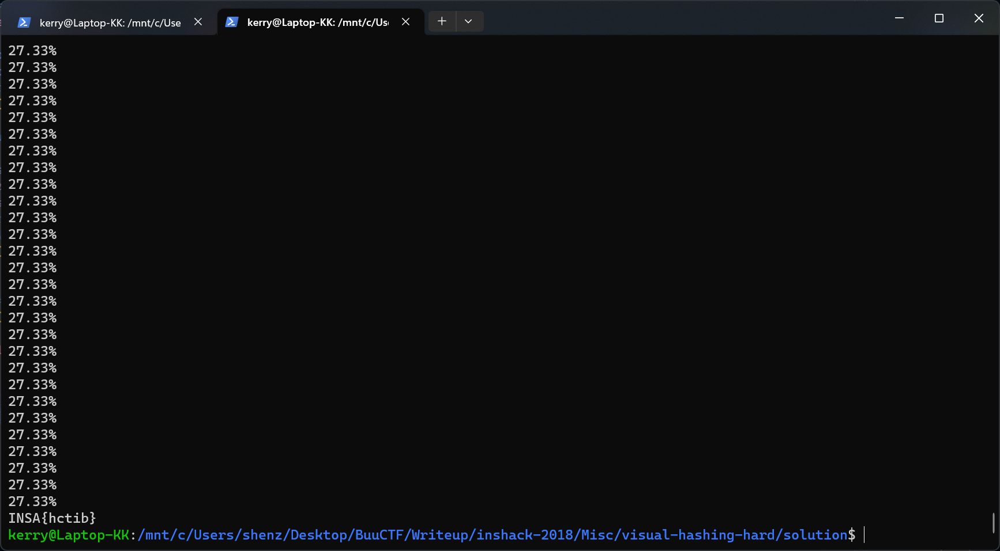

# INSHack 2018 - Visual Hashing Hard
***Writeup by shezik***

## 题目初探
题目简介如下：  
```markdown
# Misc | Visual hashing - hard

We recommend you to have a look at the first part of this chall (Visual hashing - easy) before attempting this one.

Our teams managed to infect a French Bureau of Investigation expert who uses [the same extension](https://chrome.google.com/webstore/detail/visual-hashing/lkoelcpcjjehbjcchcbddggjmphfaiie), however our spy forgot to click "Remove USB safely" so now the video file is all corrupted.

We managed to save one of the frames from the capture, see what you can do with it. Also, we know that the password has the format INSA{<lowercase>}. Good luck.
```

《没安全弹出 U 盘》乐死我了

附带一张颇有 Glitch Art 风格的截图：  


目前掌握的信息：
- 密码共 11 位，除去 `INSA{}` 还需要穷举出 5 位小写字母，也就是 26<sup>5</sup> = 11,881,376 种组合方式。
- 密码 Hash 的四种颜色 #1B9C0E #B55855 #BC6578 #A047C9。

打算分析一下这个 Chrome 扩展的 Hash 算法。

## 代码审计
首先下载扩展 crx 文件并解压，如下（跟我说，谢谢 HDR）：  
  


只看关键代码：  
```javascript
// 计算密码的 SHA1，调用 getDataURLForHash() 生成 canvas 作为背景
function updateVisualHash(elem) {
    if (elem.value == '' || elem != document.activeElement) {
        restoreBackgroundColor(elem);
        return;
    }
    var passwordHash = SHA1(elem.value);
    var elemWidth = Math.max(elem.clientWidth,elem.offsetWidth);
    var elemHeight = Math.max(elem.clientHeight,elem.offsetHeight);
    elem.style['backgroundImage'] = 'url(' + getDataURLForHash(passwordHash,elemWidth,elemHeight) + ')';
}

// 将字符串形式的 Hash 解析为 16 进制，每字节加上或减去 3（不会溢出），再替换进原字符串
// 可能是为了防止获取到真实 Hash？
function randomizeHash(passwordHash) {
    // Add a little bit of randomness to each byte
    for (var byteIdx = 0; byteIdx < passwordHash.length/2; byteIdx++) {
        var byte = parseInt(passwordHash.substr(byteIdx*2,2),16);
        // +/- 3, within 0-255
        byte = Math.min(Math.max(byte + parseInt(Math.random()*6)-3,0),255);
        var hexStr = byte.toString(16).length == 2 ? byte.toString(16) : '0' + byte.toString(16);
        passwordHash = passwordHash.substr(0,byteIdx*2) + hexStr + passwordHash.substr(byteIdx*2+2);
    }
    return passwordHash;
}

// 随机化 Hash 后从左侧取三个字节作为 16 进制颜色，重复四次，填满四个色块
function getDataURLForHash(passwordHash,inputWidth,inputHeight) {
    var win = window;
    try {
        win = unsafeWindow;   
    }
    catch(e) {}
    var canvas = win.document.createElement('canvas');
    canvas.height = inputHeight;
    canvas.width = inputWidth;
    var context = canvas.getContext('2d');
    
    passwordHash = randomizeHash(passwordHash);

    for (var hashBandX = 0; hashBandX < 4; hashBandX++) {
        context.fillStyle='#' + passwordHash.substr(hashBandX*6,6);
        context.fillRect(hashBandX/4*inputWidth,0,inputWidth/4,inputHeight);
        
        context.fillStyle='#000000';
        context.fillRect(((hashBandX+1)/4*inputWidth)-1,0,2,inputHeight);
    }

    context.strokeStyle='#000000';
    context.strokeRect(0,0,inputWidth,inputHeight);

    return canvas.toDataURL();
}
```

## 撰写脚本
了解颜色 Hash 的原理后，就可以着手编写 Python 脚本了。如下：  
```python
from hashlib import sha1
from math import floor

colorCode = ['1B9C0E', 'B55855', 'BC6578', 'A047C9']

target = list()
for a in range(len(colorCode)):
    for b in range(3):
        target.append(int(colorCode[a][b*2 : b*2+2], 16))


loopN = 0
while True:
    print('%.2f'%(loopN / (26**5 - 1) * 100) + '%')
    guess = ''
    tmpLoopN = loopN
    while True:
        guess += chr(ord('a') + tmpLoopN % 26)
        tmpLoopN = floor(tmpLoopN / 26)
        if tmpLoopN == 0:
            break
    while len(guess) < 5:
        guess += 'a'
    guess = guess[::-1]

    hashed = sha1('INSA{{{}}}'.format(guess).encode('utf-8')).hexdigest()  # lol
    for i in zip(target, [int(hashed[x*2 : x*2+2], 16) for x in range(floor(len(hashed) / 2))]):
        if abs(i[0] - i[1]) > 4:  # ??
            break
    else:  # No break in for loop
        print('INSA{{{}}}'.format(guess))
        break

    if guess == 'zzzzz':
        print('No solution found!')
        break
    loopN += 1
```

这个脚本参考了官方 Writeup 给出的答案。（实在写得是好！！）  
不过做出了一个改动。如果将标有 *# ??* 行中的 4 改为 3，就解不出答案。也许是取色器的问题？

运行结果如下：  


## 总结
学到了：
- zip() 函数的使用方法
- 可以使用 for 循环构建列表
- 使用取余的方法遍历字符串的组合方式（类似于进制间的互相转换）
- 如果 for 循环没有被 break 提前终止，执行 else 语句
- format 字符串中大括号的转义方法是两个大括号（离谱）

~怎么感觉我在学 Python~
