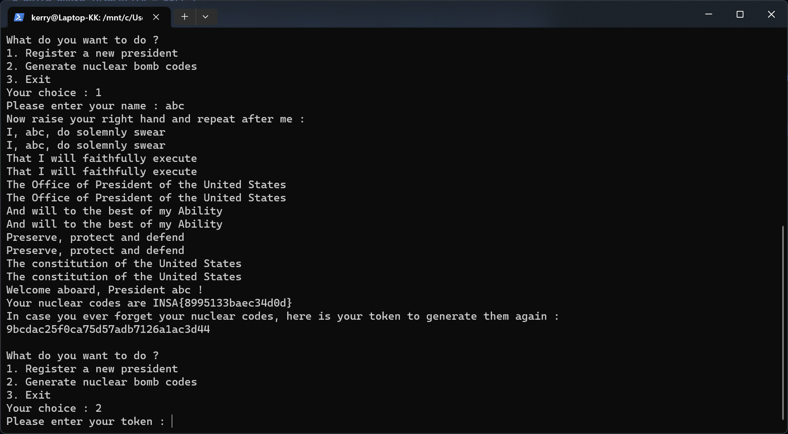
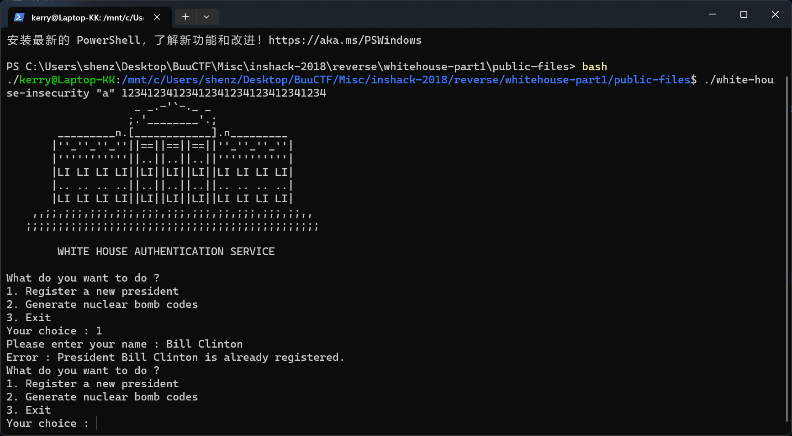
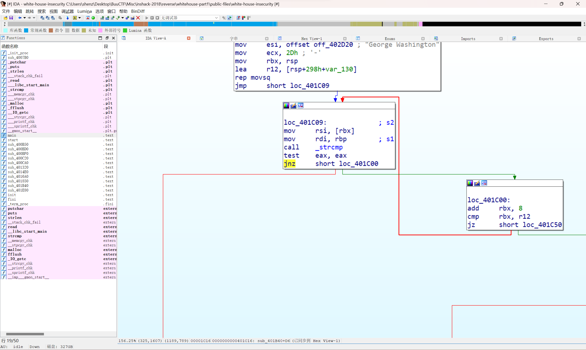
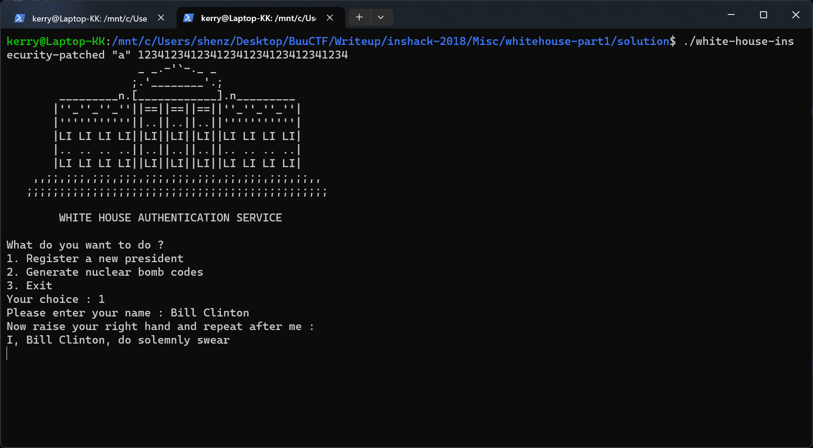
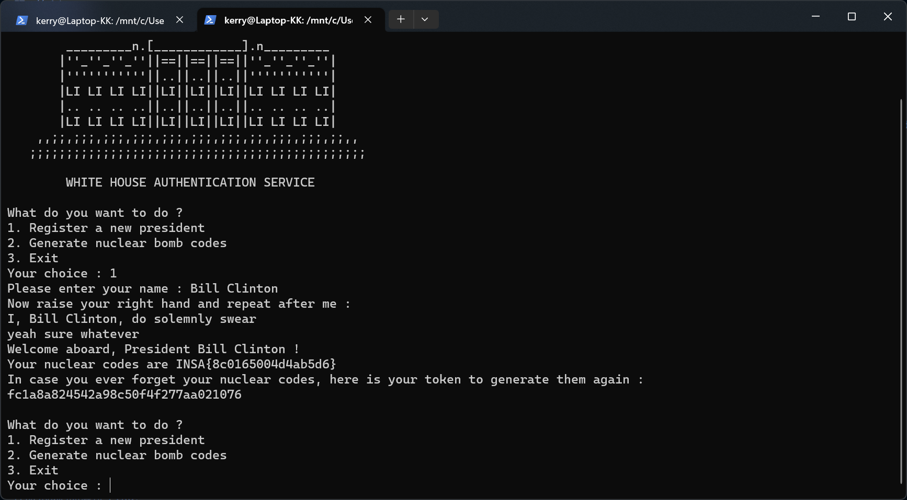

# INSHack 2018 - White House InSecurity Part 1
***Writeup by shezik***

## 题目初探
题目简介如下：  
```markdown
# White House InSecurity - Part 1

We got access to the White House's registration page which allows to recover nuclear bomb codes.

Will you be able to recover the nuclear codes for `Bill Clinton` ?

Please note that it's easy to get a nuclear code that looks like a flag for any username, but only `Bill Clinton`'s code will be valid (and you guessed it, the system won't let you get that one too easily).

The White House's server is available at `nc whitehouse.ctf.insecurity-insa.fr 18470`
```

服务器早就关了  
还好源码里包含了先前分发的可执行文件，运行一下，输出  
```shell
kerry@Laptop-KK:/mnt/c/Users/shenz/Desktop/BuuCTF/Misc/inshack-2018/reverse/whitehouse-part1/public-files$ ./white-house-insecurity
Usage : ./white-house-insecurity [master nuclear code] [encryption key, 16 hex bytes]
```

怎么还有两个参数？？最后还是读了一下官方 Writeup，其指出这两个值和这道题暂时无关（用于第二部分），先乱填一下，跑起来。

## 解题过程
注册一下，过一把美国总统瘾（？）
  
可以看到返回了 abc 总统的核弹发射密码和 Token。

这道题的 Flag 是克林顿的核弹发射密码（草）然后要生成发射密码的话可以 1. 注册为他；2. 使用这位总统的 Token。尝试注册为克林顿：  
  
不能重复注册！拿 IDA Patch 一下就好了（

搜索 `already registered` 字符串并跳转到引用，最后发现这个 `jnz` 是关键跳转。  


这里把 `jnz` 改成 `jmp`。成果如下：  
  
这个宣誓是可以跳过的，只需要在第一句时输入 `yeah sure whatever` 就可以了（草）

注册完成后即得到 Flag：  


## 总结
学到了：
- IDA 逆向简单操作
- ~入侵白宫并发射核弹是可行的~
